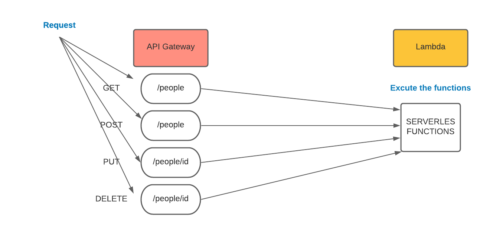

# serverless-api

## What is the root URL to your API?
https://ry3hp86vhh.execute-api.us-east-2.amazonaws.com/people

## What are the routes?

1. GET	/people
2. GET	/people/{id}
3. POST	/people
4. UPDATE	/people/{id}
5. DELETE	/people/{id}
## What inputs do they require?
Method |  input
------ | -----
GET |	nothing
GET |	nothing
POST |	JSON obj in body
UPDATE |	JSON obj in body
DELETE |	nothing
## What output do they return?

+ GET /people	==> all the items
+ GET /people/id ==> item that match id param
+ POST /people	==> item which created 
+ UPDATE /people/id ==> updated item
+ DELETE /people/id ==> empty obj
## UML Diagram

check

